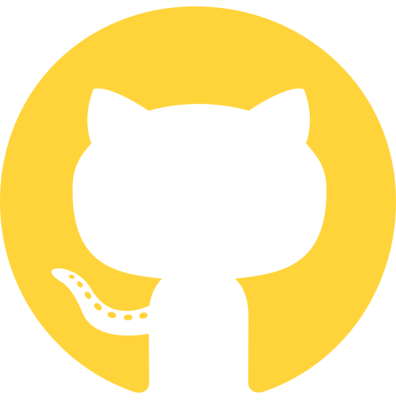

# Hi there 👋, I'm Devansh Tyagi

### Aspiring Data Scientist | AI/ML Engineer | Full-Stack Developer

I'm a final-year Computer Science student (AI/ML specialization) at Ramanujan College, University of Delhi, with a **9.27 CGPA**. I engineer predictive neural network models, deploy real-time ML solutions using FastAPI and Next.js, and build full-stack applications. My blend of statistical thinking, deep learning expertise, and front-end craft lets me take projects from raw data all the way to polished user-facing products.
 

---

### ⚙️ Languages and Tools

  

 
 

#

- 🔭 Currently building: real-time ML-powered web applications
- 🌱 Currently deepening: Deep Learning, Model Deployment, and Data Engineering
- 🎓 Expected graduation: **August 2026**
- 📫 How to reach me: tyagidevansh3@gmail.com

 
 

<!-- # -->

<!-- ### 📊 Stats

 -->

---

